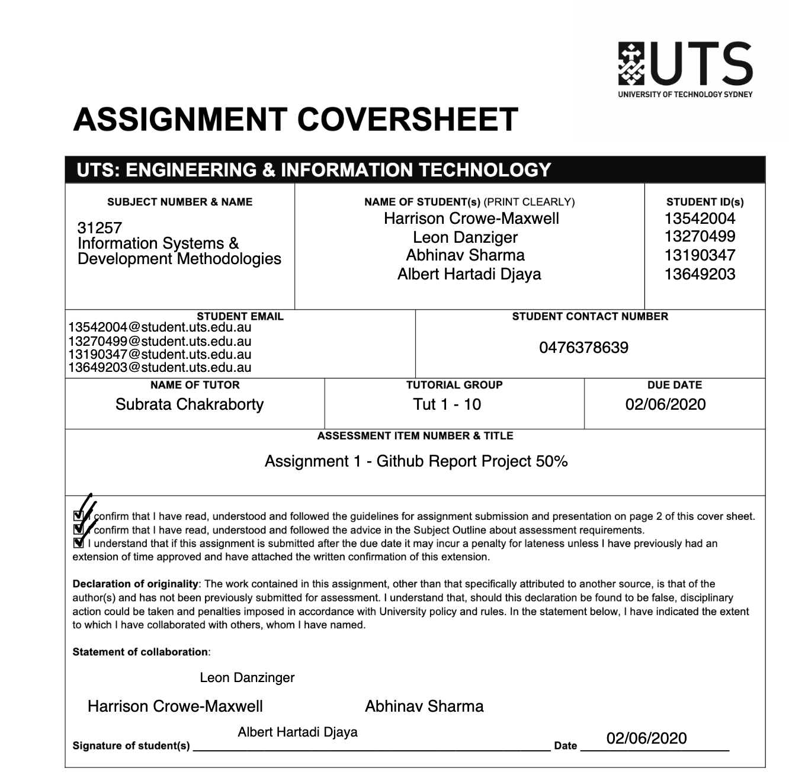
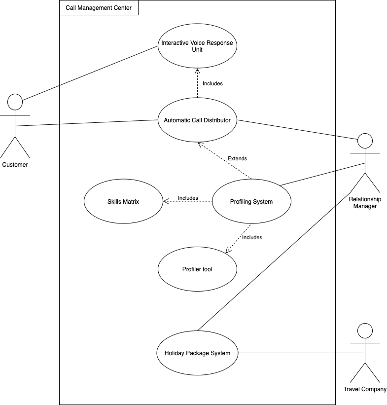
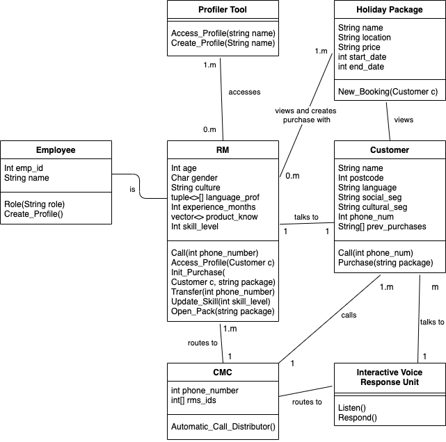
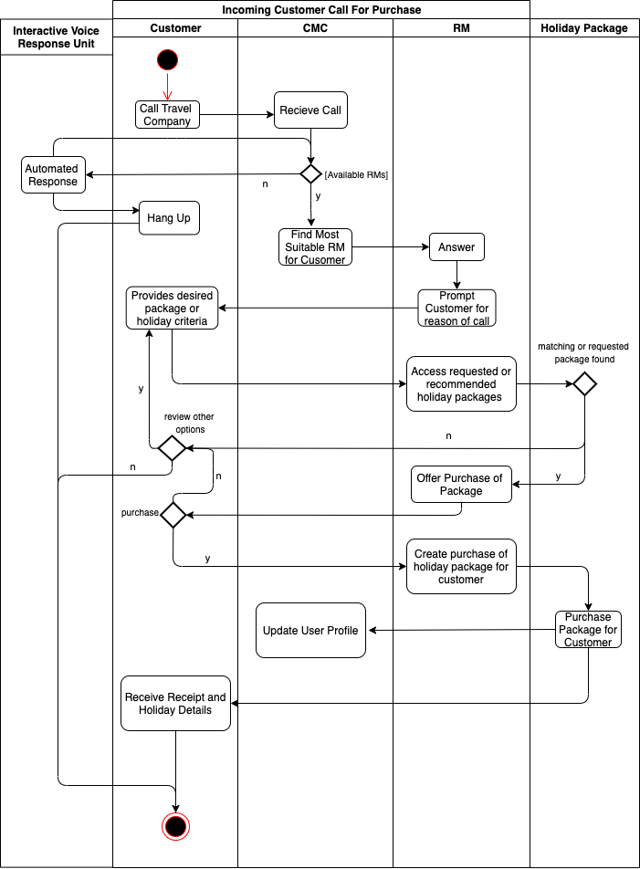
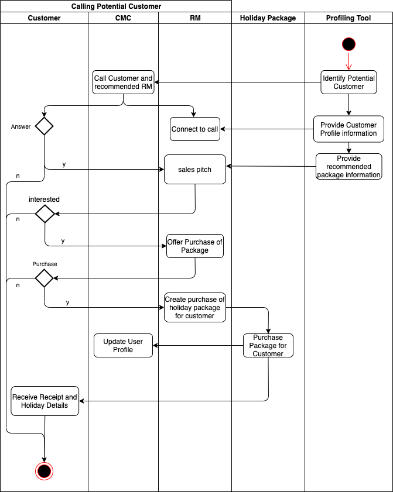
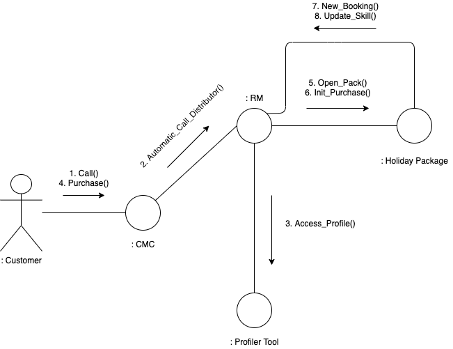

Call Management Center Information System Business Report-

Online Video: [Travel Company Assessment Runthrough](www.youtube.com/) <- insert hyperlink in

Table of Contents:

Project Objectives                                                               (Line - 24)  
Problem Definition                                                               (Line - 47)  
Stakeholders                                                                       (Line - 62)  
Design Thinking Principles Approach                                 (Line - 79)  
Agile Scrum Outline                                                            (Line - 90)  
Assumptions                                                                       (Line - 99)  
Proposed Workproducts & Models                                     (Line - 122)  
Advantages of System                                                        (Line - 142)  
Consequences of System Failure                                       (Line - 149)  
References                                                                          (Line - 156)  
Appendices                                                                         (Line - 171)  

Project Objectives:

1. Simplify operations involved with the volume and types holiday packages

2. Develop a more detailed initial profile for RM employees at hiring

3. Improve criteria used for score calculation of inbound calls

4. Imrpove criteria used for skill score calculation of RMs 

5. Increase volume of information stored in database 

6. Enchance script/guidline output system quality 

7. Increase complexity of tuple used for targeting list 

8. Increase adapdability of Interactive Voice Response Unit 

9. Introduce system whereby customers of a low priority can be handed to low level RMs or other employees in the business

Problem Definition:

The problem faced by the travel company must be precisely defined in order to enable the development of an effective and greatly beneficial solution that meets the needs of our client’s expectations and allows them to improve their business functions. Customers having long wait times for relationship managers, or being directed to a relationship manager with whom they don’t work well with after struggling to get through the interactive voice response unit are key issues and few of many that plaque other call management centres, our system seeks to address these key issues among others. The empathy principle is a valuable tool in creating solutions that possess the functionality required by the end users, and so by putting ourselves in the shoes of the stakeholders we have identified these key issues: 

(1) The new system must be speedier and more efficient than the current one, reducing stress and preventing frustration on part of the customers and other stakeholders. This will be achieved through increasing the adaptability of the Interactive Voice Response Unit and making sure that customers of a low priority can be handed to low level RMs or other employees in the business.

(2)	The new system should simplify the operations involved with the volume and types holiday packages while developing a more detailed initial profile for relationship managers at the time of their hiring with a more detailed analysis of their characteristics and how best to use them to sell holiday packages.

(3) The new system should improve criteria used for score calculation of inbound calls by increasing complexity of tuples used for targeting list, this will be achieved through improving the criteria used for skill score calculation of RMs which will also consequently enhance the script/guideline output system quality to equip the RMs with a more effective strategy.

(4) And finally to provide for the growth of the business the new system must increase volume of information stored in database.

Stakeholders:

Stakeholders of a bussiness project are defined as those who may come in contact with, are are dirrently involved in or hold specific interest in regard to the business processed carried out by a developed system. With this their perspectives and individual inputs into the design and functionality of the system dictate the end result. As the developers of the Travel Company's Call Management Center Software, it is import to weight and evaluate the requirements and feedback from these stakeholders. The first step in this process is to identify all revelant stakeholders of the system being developed. They are as follows:

Client / Travel Company - As the client of this development project, the requirements and restrictions, being technical, operational, economic or scheduling, that are imposed by this stakeholder must be evaluated and abided by to ensure the continuous development of said project.

User / Relationship Managers - As a user with high level access and a large dependency on the system the requirements and feedback given by the Relationship managers will be vital in the development of this system. The Relationship Managers must be able to easily understand and make use of the system in order for it to function and, therefore, play a central role in the business processes that this system attempts to compliment.

User / Cusomters - Customers are the target users of the system. This dictates that the system must be appealing and useful for them, especially as its purpose if for sales and marketing reasons. Users will contact the travel company and by contacted for the main purpose of purchasing a holiday package, therefore their experience with the system will play a large role in marketing and encouraging the user to make the purchase. 

Developers - Developers must understand and agree with the methods of which the system is being developed and integrated. This means that the input of developers must play a large role in the designing of not only the system itself, but the business requirements that compose it.

Investors - Those who hold a financial interest in the project at hand must be revered as important stakeholders in the system's development. Investors must be able to see an effective use of resources in terms of server processing or storage costs as well as being able to advise the client on budgetary restrictions dirrectly relating to the development of the system. Ensuring that the investors are identified and acknowledged as important stakeholders in the system is crucial for any development's successful completion.

Design Thinking Principles Approach:

This system is user-focused and is targeted at providing efficient and quick management of incoming calls. In terms of the design thinking principles, empathising with the user requires an analysis of the system from their perspective. Gathering an accurate and measurable understanding of the system from this perspective is the main barrier to the principle at hand. To do so, the use of interviewing tools in the form of client/stakeholder meetings, surveys and the like can be implemented to obtain the required information. The empathising principle requires identifying the difficult or least user-friendly aspects of the current solution, i.e. the points of greatest resistance. Within the context of this system the most resistance to the system could be long wait times for RMs (relationship managers), incorrect assumptions made about a customer in the RM routing system or even difficulty interacting with an Interactive Voice Response Unit when directed to it in a busy time.
Following on from this is the problem definition principle. Within this stage the issues with the current system that are planning to be overcome by the new system as well as the problems identified by users and stakeholders within the empathise principle are documented and analysed. These problems are broken down into their key components and the aspect of the system from which they relate to. From this, a clear view of what functionality is required by the new system is discovered. Another effective technique that can be used in conjunction with the first principle is to include user suggestions for how these problems that they have identified can be resolved, giving another perspective and depicting the functionality's issues in more detail. The RM system presents an issue in the operation of a major travel company's call management centre (CMC), how their customers are categorised and routed as well as the identification and prioritisation of potential new customers. These problems along with user feedback provide the base for the problem definition principle and are then further broken down to move into the next stage.
Ideation otherwise known as the ideate principle aims to construct solutions to the defined problems. This involves the identification of each core problem and works to brainstorm and provide potential options for resolutions. This stage of the design thinking processes is highly collaborative and requires all involved parties working together to create a feasible solution for each problem. For the ideation stage of the RM system, all team members go through the problems outlined, inferred from the discussion topic information on the travel company's call management centre. From this, a plan of implementation of the most feasible solutions can be made.
Next is the principle of prototyping. Once a range of feasible solutions has been made for each of the core problems, a prototype for comparison or compatibility allows for the most beneficial solutions to be chosen for implementation with an assurance that their designed or logical functionality solves the problems at hand in a way the seamlessly interacts and does not interfere with other system functions. For the proposed CMC system, a range of logic algorithms can be simulated for prototyping purposes in a controlled environment as well as trials on existing or potential customers. This allows for solutions that may work in theory but not necessarily in practice to be identified and replaced with solutions that work in the given contextual situation.
Finally is the testing principle phase. Once a solution has been identified and is in development testing is required to assure it meets the requirements and functions as intended before it is implemented as a live solution. In the context of the CMC system, the most effective method for implementation would be a piloted approach. This would allow for ample live testing determine a satisfactory working system is running as well as fix any bugs that are bound to arise as the system faces its first interaction with the real everyday business processes.

Agile Scrum Outline:

scrum is an agile methodology, commonly used in software development in which the scrum team aims accomplish goals in short periods of time, to be flexible in their development and to adapt to any changes needed. There are five values associated with scrum, courage, focus, commitment, respect and openness. These are the five values that our team would follow the entire project, these five values have helped us work together as a team and improved our teamwork and communication together. 
There are three roles in the scrum team, the scrum master, product owner and the development team. The scrum master is responsible for ensuring that the members of the team follow the scrum values and practice, the scrum master is also responsible for helping the product owner understand the scrum team to help them work better together. The product owner is responsible for knowing the customer of the product and setting a clear vision for the scrum team they are also mainly responsible for the product backlog. The development team is the one that is actually responsible for developing the product they have a responsibility to be transparent about their work and adapt to any changes needed. These roles help us to define each member’s responsibility and help us define a clear goal for each role.There are five events that take place in scrum, The Sprint, Sprint planning, Daily scrum, Sprint review, Sprint retrospective. 
The sprint is a time-box period of one month or less where a potential part of the product is created, after a sprint is completed the next one immediately starts, the planning for the sprints takes place in the sprint planning where goals for the next sprint are discussed. The daily scrum is an event that takes place daily where the development team plans their activity for the day. the sprint review takes place after the sprint and everybody is involved, this is where the product backlog is reviewed and the development team talks about what went well and what went wrong about the sprint, the sprint retrospective takes place after the sprint review and plans are discussed for the next sprint with improvements that could be made discussed. Using these events as a framework to develop our product we have worked in a very organized manner efficiently. There are three artifacts used in the scrum methodology, the product backlog, sprint backlog and the increment. The product backlog is simply a list of everything that will be needed for the product, the sprint backlog is a list of items selected for the sprint and the increment is a list of items completed from the sprint backlog. Using these artifacts, we organize our goals and the requirement for the project which can be adapted as needed

Assumptions:

Assumptions, within the analysis of a potential business systems,  allow for the conversion and 'filling in the gaps' when translating from presented business processes to technical terminology that can be further broken down and developed. Assumptions result in a complete picture of a system without all its components being specifically depicted. This must be further checked with the client to ensure that any assumptions made do not contridict their intentions for the system. The assumptions made within the analysis of theTravel company brief include:

Profiler Tool is developed enough for the uses of the business 

There are more employees that are available other than RMs

Database used for targeting list has sufficient volumes of data to produce scripts and guidlines for RMs 

RMs already have a developed knowledge of holiday packages and thus able to service customers without training

The skill score calculation is accurate enough to portray RMs skill correctly 

Score calculation used for customers is accurate enough to correctly identify the likelihood of customers to make a purchase 

The system can sufficiently match RM profiles with customer details

Method used to adjust RM profiles over time is balanced and accurate 

Proposed Workproducts & Models:

Usecase Diagram for the Travel Company CMC System:  
  

CMC System Class Diagram:  
  

Activity Diagram for User making a call:  
  

Activity Diagram for Relationship manager calling new potential customer:  
  

Collaboration Diagram for Travel Company CMC System:  
  

Advantages of System:

Advantages of implementing the new system stretch far and wide by not only eliminating current problems faced by our client, but also through providing a substantial improvement in functionality and efficiency for achieving business objectives and facilitating daily business activities as outlined in the objectives and problem definition. The system will benefit all areas and stakeholders associated with the travel company through allowing them to carry out their intrinsic and critical business operations in a more effective manner. This provides our client with a competitive advantage and will ultimately lead to an increase in shareholder wealth.

Consequences of System Failure:

The consequences if the new system fails can have a profound negative impact on the smooth operation of our client, this may affect anything from the relationship managers being unable to make to create new leads and contact new potential customers, or being unable to follow up and contact customers who are already in the process of making a purchasing decision. This may lead to causing the business to halt operations as the efficient functioning of the call management system centre is essential for business activities and ultimately required to enable the maximisation of shareholder wealth. The estimated impact of such a failure would be directly dependent on how heavily the system is relied upon by stakeholders such as the relationship managers for their business activities. This is also linked with how much of the system is currently implemented and in use or at what stage it is in during its implementation phase, as well as how well the contingency plans can take over or the availability of a backup system. This system is of critical importance to business function and is greatly depended on, therefore it is of equal importance and in the best interests of all shareholders to ensure the system is designed and can be incorporated in the business in a way that guarantees its rock solid reliability.

References:

Harshani Chathurika, Jul 17 2019, Principles of Design Thinking, Viewed 29/05/2020, [<https://uxplanet.org/principles-of-design-thinking-stages-of-design-thinking-b2cc219063ac>](https://uxplanet.org/principles-of-design-thinking-stages-of-design-thinking-b2cc219063ac)

Visual Paradigm, 2020, UML Collaboration Diagram, Viewed 30/05/2020, [<https://www.visual-paradigm.com/guide/uml-unified-modeling-language/what-is-uml-collaboration-diagram/>](https://www.visual-paradigm.com/guide/uml-unified-modeling-language/what-is-uml-collaboration-diagram/)

Lucid Chart, 2019, UML Activity Diagram Tutorial, Viewed 30/05/2020, [<https://www.lucidchart.com/pages/uml-activity-diagram>](https://www.lucidchart.com/pages/uml-activity-diagram)

Atlassian. 2020. Agile Scrum Roles | Atlassian. [online] Available at: <https://www.atlassian.com/agile/scrum/roles> [Accessed 31 May 2020].

Scrum.org. 2020. What Is Scrum?. [online] Available at: <https://www.scrum.org/resources/what-is-scrum> [Accessed 31 May 2020].

Appendices:

CMC - Call Management Center

UML - Uniform Modelling Language

RM - Relationship Manager

